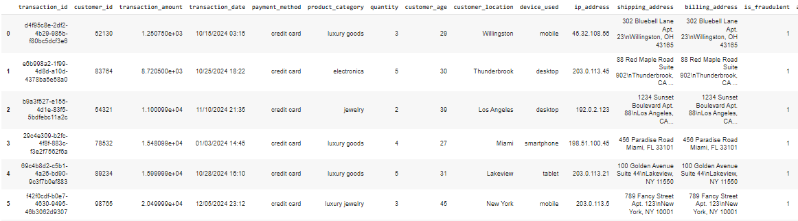

# Geração de dados sintéticos para transações fraudulentas de e-commerce

Alunos:
*   Gustavo Bauer Nogueira
*   Leonardo Severgnine Maioli
*   Thiago Alexandre Paiares e Silva

## _índice_

- <a href="#intro">Introdução</a>
- <a href="#tecnologias-utilizadas">Tecnologias utilizadas</a>
- <a href="#codigo">Código</a>
- <a href="#resultados">Resultados</a>
- <a href="#referencias">Referências</a>

## _Introdução_

**Dados sintéticos** são dados gerados artificialmente e que imitam as propriedades estatísticas e as características de dados reais. Esses dados podem ser gerados por meio de IA generativa e são empregados em diversos setores e indústrias, com destaque para cenários onde a obtenção de dados reais é limitada por questões de privacidade, custo ou acessibilidade.

Nesse trabalho da disciplina **Processamento de Linguagem Natural** da UFABC, o grupo realizou o estudo do artigo **Synthetic Data using LangChain and OpenAI: The Ingenious Shortcut to Data Science’s Success** disponível gratuitamente [aqui](https://medium.com/@viritaromero/synthetic-data-using-langchain-and-openai-the-ingenious-shortcut-to-data-sciences-success-7dbccfdd3a5e). Ao longo do artigo, a autora utiliza um exemplo real para demonstrar a importância dos dados sintéticos. Nesse exemplo, ela utiliza o framework LangChain e um modelo da OpenAI para gerar dados sintéticos que incluem detalhes típicos de transações de e-commerce fraudulentas, como grandes valores de transação ou endereços IP suspeitos. Esse conjunto de dados gerados pode ser valioso visto que pode ser empregado no desenvolvimento e teste de modelos de machine learning para detecção de fraudes em transações de e-commerce.

A partir desse artigo, o grupo repetiu o processo exposto pela autora, implementando algumas melhorias e adicionando a etapa de validação dos dados sintéticos gerados.

## _Tecnologias utilizadas_

Assim como a autora, o grupo utilizou a linguagem **Python** com o framework **LangChain** junto de um modelo da **OpenAI**, variando entre os modelos gpt-4o-mini e gpt-4o.

## _Código_

O código desenvolvido e as explicações detalhadas de cada etapa estão disponíveis no formato de um notebook Python [aqui](https://github.com/LeonardoMaioli/synthetic_data_fraudulent_transactions/blob/main/synthetic_data_generation/PLN_synthetic_data.ipynb)!

## _Resultados_

Os resultados obtidos podem ser melhor explorados no código citado anteriormente. Na figura abaixo tem-se uma pequena amostra dos dados sintéticos obtidos para transações fraudulentas.

## _Referências_

1.   JAGTAP, Shriyash. Fraudulent E-Commerce Transactions. A Synthetic Dataset for Fraud Detection and Analysis in E-Commerce Transactions. Disponível em: [https://www.kaggle.com/datasets/shriyashjagtap/fraudulent-e-commerce-transactions](https://www.kaggle.com/datasets/shriyashjagtap/fraudulent-e-commerce-transactions). Acesso em: 28 ago. 2024.
2.   MARTINEZ, Viridiana. Synthetic Data using LangChain and OpenAI: The Ingenious Shortcut to Data Science’s Success. Disponível em: [https://medium.com/@viritaromero/synthetic-data-using-langchain-and-openai-the-ingenious-shortcut-to-data-sciences-success-7dbccfdd3a5e](https://medium.com/@viritaromero/synthetic-data-using-langchain-and-openai-the-ingenious-shortcut-to-data-sciences-success-7dbccfdd3a5e). Acesso em: 28 ago. 2024.

